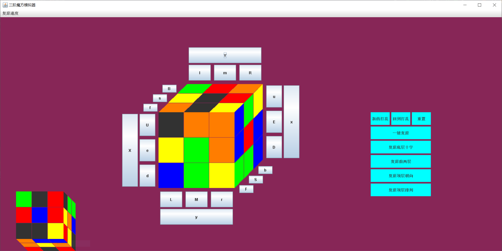

# RubiksCubeSimulator
三阶魔方模拟器，可自动复原，用Java Swing实现图形用户界面。  
A 3*3*3 Rubik's Cube simulator.  Automatical cube solution. Uses Java Swing to implement a graphical user interface.

  

## Docs
+ 设计文档.pdf  

        
     

          
